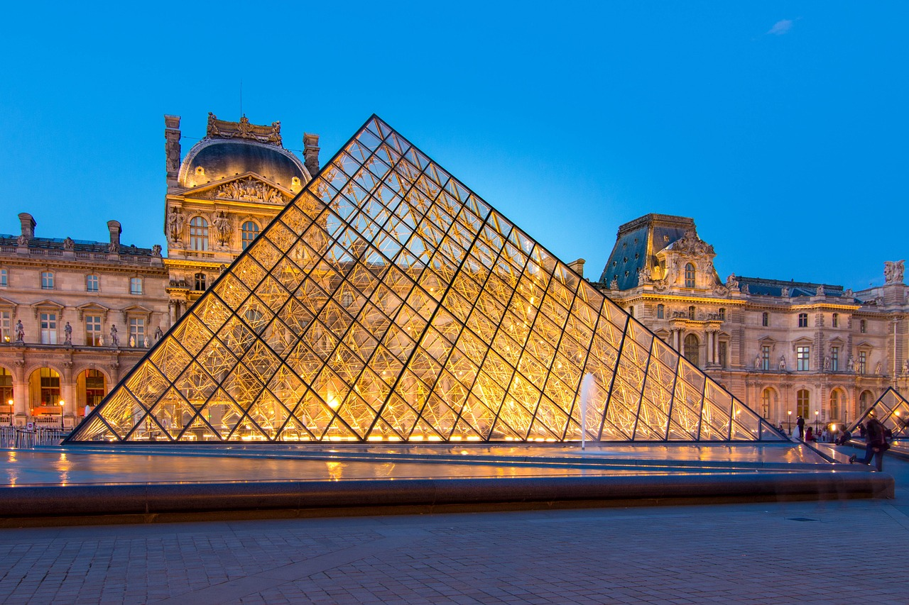

# Retrieve Artworks from the Louvre Museum Using Scraping and API

 

  

 

## Main objective

Collect information on all artworks from the Louvre Museum website, utilizing both scraping and Le Louvre Museum API.

 

## Methodology and tools used

 

Here are the steps we undertook to retrieve information about the artworks :

- Step 1 : use a [scrapy script](1_scrap_urls/scrap_le_louvre_urls_all_museum.py) to retrieve all the artwork names and the corresponding URLs in the form of a [json file](1_scrap_urls/scrap_le_louvre_urls_all_museum.json)

- Step 2 : query asynchronously each of the urls retrieved in the previous json file using the Musée du Louvre API to [fetch information on all the works of art](2_retrieve_all_infos_all_works_of_art_using_API/all_infos_all_works_of_art_louvre_museum_using_api.ipynb), and store them in a [large csv file](2_retrieve_all_infos_all_works_of_art_using_API/all_works_of_art_le_louvre_uncleaned.csv)

- Step 3 : optional step where we [select the main information about only the artworks that are currently on display](3_optional_simple_extraction_from_raw_dataset_le_louvre/simple_extracts_le_louvre_work_of_arts_on_display.ipynb) at Le Louvre Museum, and store them into several csv files : one for [all the collections](3_optional_simple_extraction_from_raw_dataset_le_louvre/simplified_le_louvre_works_of_art_on_display_all_dpts.csv), one for [only the Antiquities](3_optional_simple_extraction_from_raw_dataset_le_louvre/simplified_le_louvre_works_of_art_on_display_antiquities.csv), and one for [the paitings](3_optional_simple_extraction_from_raw_dataset_le_louvre/simplified_le_louvre_works_of_art_on_display_paintings.csv)

| Step | Used Tools |
|------|------------|
| Data Collection |     |   

 

## Results
